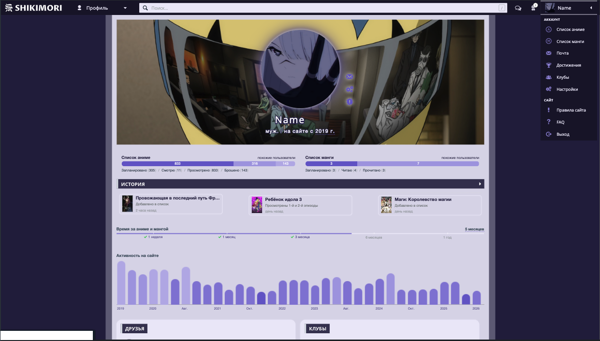

# Shikimori CSS


---


Кастомные стили для сайта [Shikimori](https://shikimori.one/) ([зеркало](https://shikimori.io/), [зеркало](https://shiki.one/)). Позволяет изменять внешний вид сайта под свои предпочтения, используя современный SCSS с автоматической поддержкой старых браузеров.

---

## Доступные скрипты

```bash
   npm install
```
```bash
   npm run prefix
```
```bash
   npm run minify
```
```bash
   npm run build
```

---

##  Особенности

- **Современный SCSS** — пишите стили с вложенностями, переменными и миксинами
- **Автоматическая поддержка браузеров** — Autoprefixer добавляет необходимые вендорные префиксы (IE11, старые версии Chrome/Firefox)
- **Минификация** — готовый CSS сжат для быстрой загрузки
- **Простая установка** — несколько команд и стили готовы к использованию

---

##  Требования

- [Node.js](https://nodejs.org/) (версия 14 или выше)
- Любой современный браузер для просмотра результата

---

##  Быстрый старт

### 1. Склонируйте репозиторий

```bash
git clone https://github.com/Sergey-Maxim0v/shikimori-css.git
cd shikimori-css
```

### 2. Установите зависимости

```bash
npm install
```

### 3. Настройте стили

Отредактируйте файл `src/scss/main.scss` под свои предпочтения

### 4. Соберите CSS

```bash
npm run build
```

### 5. Примените на Shikimori

- Откройте файл `dist/css/main.min.css`
- Скопируйте всё содержимое `Ctrl+A`, затем `Ctrl+C`
- Зайдите на [Shikimori](https://shikimori.one/)
- Перейдите в `Настройки` → `Внешний вид сайта`
- В поле `CSS` вставьте скопированный код `Ctrl+V`
- Нажмите `Сохранить`

Готово! Ваши стили применены к профилю.


## Структура проекта

```plaintext
shikimori-css/
├── public/
├── src/
│   └── scss/
│       └── main.scss       # Ваши стили (редактируйте здесь)
├── dist/
│   └── css/
│       ├── main.css        # Промежуточный результат
│       └── main.min.css    # Финальный файл (копируйте на сайт)
├── .browserslistrc         # Настройки поддержки браузеров
├── package.json            # Зависимости и скрипты
└── README.md               # Этот файл
```
